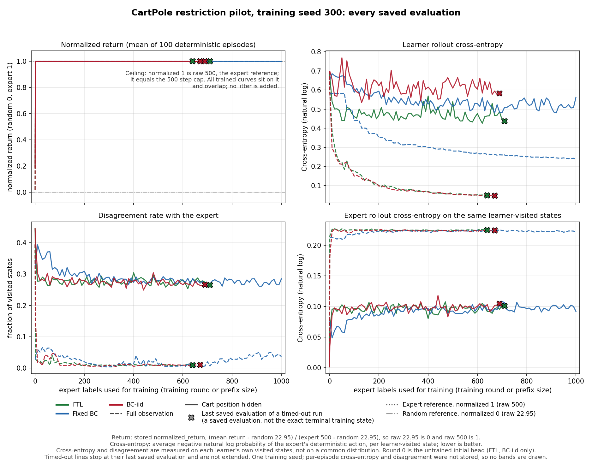
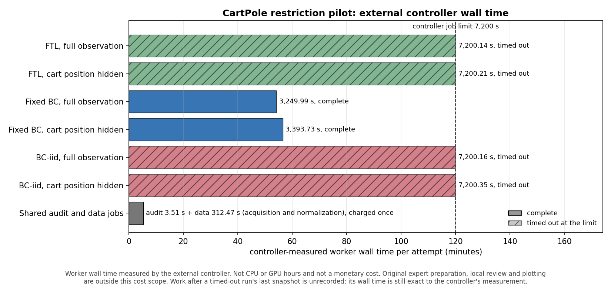

# CartPole restriction pilot: results

Records as of the last controller attempt end, September 30, 2026, 6:17 pm Phoenix time (October 1, 01:17 UTC). This report covers the six learning runs of the approved paired pilot in [`CARTPOLE_PILOT_PROTOCOL.md`](CARTPOLE_PILOT_PROTOCOL.md); the audit and data gates are described in [`CARTPOLE_PILOT_STATUS.md`](CARTPOLE_PILOT_STATUS.md). It is analysis only. No job was relaunched, retried or extended for it, and no scientific setting changed. The raw records (results, checkpoints, logs) stay private; this report, its two figures and its two JSON files are derived summaries.

## Outcome

- 2 of 6 runs completed; 4 were stopped by the external 7,200 second job limit (`timed_out`). Timed-out runs are reported up to their last saved evaluation only.
- Every saved evaluation of a trained policy, in all six runs and both observation conditions, scored 500 in all 100 episodes, starting with the first one-label evaluation (stored normalized return 1, which corresponds to raw 500). Return is at its ceiling and cannot separate methods or observation conditions here.
- Cross-entropy and disagreement are reported as recorded; each is measured on that learner's own visited states.
- Fixed BC and BC-iid also differ in optimization (below), so their comparison does not isolate data acquisition.

## Run status

| Method | Observation | Controller state | Controller elapsed (s) | Last saved training round | Last evaluated label count | Saved record |
| --- | --- | --- | ---: | ---: | ---: | --- |
| FTL | full observation | `timed_out` | 7,200.14 | 646 | 640 | `running`, `snapshot.final=false` |
| FTL | cart position hidden | `timed_out` | 7,200.21 | 717 | 710 | `running`, `snapshot.final=false` |
| Fixed BC | full observation | `complete` | 3,249.99 | 1,000 | 1,000 | complete, final |
| Fixed BC | cart position hidden | `complete` | 3,393.73 | 1,000 | 1,000 | complete, final |
| BC-iid | full observation | `timed_out` | 7,200.16 | 670 | 670 | `running`, `snapshot.final=false` |
| BC-iid | cart position hidden | `timed_out` | 7,200.35 | 690 | 690 | `running`, `snapshot.final=false` |

The controller inventory is authoritative for terminal state. A timed-out run's saved record still says `running` because the external kill left its last atomic snapshot; it is neither a live job nor a complete result. Its in-flight operation label can lag by a round and is not used to infer what was running at termination.

## Learning curves

- Every saved evaluation is drawn. FTL and BC-iid include round 0 (the untrained initial head); fixed BC has no round 0 evaluation and starts at one label. Lines are not smoothed.
- An X marks a timed-out run's last saved evaluation. It is a saved evaluation, not the exact training state at termination, and the line is not extended toward 1,000.
- The return panel draws the stored `normalized_return`, the inherited (mean return - random return) / (expert return - random return), with the random reference 22.95 at 0 (dash-dot line) and the expert reference 500 at 1 (dotted line). Normalized 1 here corresponds to raw 500 and remains a ceiling: the expert reference equals the 500 step cap. Return curves that reach 1 coincide and overlap; no jitter is added.
- Each stored `normalized_return` was checked against its raw episode mean and the stored references, within the producer's six-decimal rounding. The stored values are plotted as recorded: none was recomputed, replaced or clipped. Tables below and both JSON files keep raw returns.
- The previous version of this figure plotted raw mean return. That was a presentation departure from the stored metric, not a different evaluation; this figure restores the stored normalized return.
- Cross-entropy (natural log) is the average negative natural log probability of the expert's deterministic action, per learner-visited state; lower is better. The earlier axis label "nats per state" named the same quantity. This is a unit clarification, not a changed metric.
- Learner cross-entropy, disagreement and expert cross-entropy are computed on the states each learner visited during its own evaluation episodes. They are not errors on a common state distribution, so a lower value does not mean lower error on the same states.

## Matched-label comparison

The largest evaluation budget shared by all six curves is **640 labels**: the maximum of the intersection of the six sets of evaluated label counts, taken mechanically and not by effect size. Values are descriptive for one training seed. No winner is selected and no test is run. Return is shown as the raw mean with the episode minimum to maximum. Cross-entropy columns use the natural log, as defined above.

| Method | Observation | Labels | Return mean (min to max) | Learner CE | Disagreement | Expert CE |
| --- | --- | ---: | ---: | ---: | ---: | ---: |
| FTL | full observation | 640 | 500.0 (500 to 500) | 0.0492 | 0.0093 | 0.2247 |
| FTL | cart position hidden | 640 | 500.0 (500 to 500) | 0.4645 | 0.2839 | 0.0919 |
| Fixed BC | full observation | 640 | 500.0 (500 to 500) | 0.2635 | 0.0065 | 0.2237 |
| Fixed BC | cart position hidden | 640 | 500.0 (500 to 500) | 0.5445 | 0.2862 | 0.0942 |
| BC-iid | full observation | 640 | 500.0 (500 to 500) | 0.0478 | 0.0098 | 0.2252 |
| BC-iid | cart position hidden | 640 | 500.0 (500 to 500) | 0.6020 | 0.2608 | 0.1032 |

Each run at its own last saved evaluation (timed-out runs end earlier, so these rows are not matched):

| Method | Observation | Labels | Return mean (min to max) | Learner CE | Disagreement | Expert CE |
| --- | --- | ---: | ---: | ---: | ---: | ---: |
| FTL | full observation | 640 | 500.0 (500 to 500) | 0.0492 | 0.0093 | 0.2247 |
| FTL | cart position hidden | 710 | 500.0 (500 to 500) | 0.4378 | 0.2649 | 0.1011 |
| Fixed BC | full observation | 1,000 | 500.0 (500 to 500) | 0.2381 | 0.0368 | 0.2219 |
| Fixed BC | cart position hidden | 1,000 | 500.0 (500 to 500) | 0.5618 | 0.2853 | 0.0919 |
| BC-iid | full observation | 670 | 500.0 (500 to 500) | 0.0479 | 0.0107 | 0.2242 |
| BC-iid | cart position hidden | 690 | 500.0 (500 to 500) | 0.5822 | 0.2662 | 0.1046 |

## Cost

Wall time is the external controller's `elapsed_seconds` per attempt, exact to its measurement. It is worker wall time, not CPU or GPU hours, and no monetary cost is implied. Each job had exactly one attempt.

| Job | Controller state | Controller elapsed (s) |
| --- | --- | ---: |
| audit (shared) | `complete` | 3.51 |
| data (shared) | `complete` | 312.47 |
| FTL, full observation | `timed_out` | 7,200.14 |
| FTL, cart position hidden | `timed_out` | 7,200.21 |
| Fixed BC, full observation | `complete` | 3,249.99 |
| Fixed BC, cart position hidden | `complete` | 3,393.73 |
| BC-iid, full observation | `timed_out` | 7,200.16 |
| BC-iid, cart position hidden | `timed_out` | 7,200.35 |

Run attempts total 35,444.57 worker-seconds; with the shared audit and data jobs, 35,760.55. The campaign took 11,203.73 seconds (3.11 hours) from the first attempt start to the last attempt end, including review gates between stages.

**Shared preparation, charged once.** The audit checked 120 pairs with 555 expert predict calls. The data job's internal timers record: fixed-BC chronological pool 0.36 s for 1,000 expert steps (2 episodes); BC-iid stream 162.17 s for 500,000 expert steps (1,000 episodes); normalization baselines 146.48 s for 261,475 steps (500 expert and 500 random episodes). These phase timers need not sum to the controller time. The full and masked fixed-BC runs reuse the pool, and the full and masked BC-iid runs reuse the stream, so this acquisition is not charged per run or per paired condition. FTL acquires its own labels inside each run (in-run collection below).

Saved counts per run. For a timed-out run these come from its last snapshot: they are observed lower bounds (environment steps) or saved counts (fits, epochs), not final totals. Null values are shown as not recorded.

| Run | Counts | Env steps observed | In-run collection steps | Evaluations | Evaluation steps | Fits | Epochs | Expert predict calls (total) |
| --- | --- | ---: | ---: | ---: | ---: | ---: | ---: | ---: |
| FTL, full observation | saved, lower bound | 3,575,418 | 322,167 | 66 | 3,253,251 | 646 | 12,920 | not recorded |
| FTL, cart position hidden | saved, lower bound | 3,969,148 | 357,655 | 73 | 3,611,493 | 717 | 11,740 | not recorded |
| Fixed BC, full observation | final | 5,050,000 | 0 | 101 | 5,050,000 | 101 | 2,020 | 5,050,000 |
| Fixed BC, cart position hidden | final | 5,050,000 | 0 | 101 | 5,050,000 | 101 | 2,020 | 5,050,000 |
| BC-iid, full observation | saved, lower bound | 3,403,251 | 0 | 69 | 3,403,251 | 670 | 13,400 | not recorded |
| BC-iid, cart position hidden | saved, lower bound | 3,511,493 | 0 | 71 | 3,511,493 | 690 | 12,618 | not recorded |

Recorded in-run phase timers (seconds). Round-loop methods time fitting together with collection; fixed BC times fits separately and collects nothing in the run. For timed-out runs these cover work up to the last snapshot, and the recorded total is null.

| Run | Setup | Collection and training | Fits | Evaluation | Recorded total | Last snapshot to controller end |
| --- | ---: | ---: | ---: | ---: | ---: | ---: |
| FTL, full observation | 0.76 | 5,045.29 | within collection and training | 2,040.42 | not recorded | 25.80 |
| FTL, cart position hidden | 0.66 | 4,710.52 | within collection and training | 2,351.52 | not recorded | 41.94 |
| Fixed BC, full observation | 0.61 | no in-run collection | 52.14 | 3,188.12 | 3,246.44 | 0.75 |
| Fixed BC, cart position hidden | 0.48 | no in-run collection | 52.71 | 3,331.43 | 3,390.19 | 0.76 |
| BC-iid, full observation | 0.14 | 4,998.92 | within collection and training | 2,106.85 | not recorded | 3.74 |
| BC-iid, cart position hidden | 0.14 | 4,792.14 | within collection and training | 2,281.74 | not recorded | 34.22 |

Original expert preparation and qualification, local review, and report and plot work are outside this cost scope.

## Interpretation and limits

- **Datasets.** Fixed BC cold-fits each prefix of a chronological pool (2 complete expert episodes, kept in order). BC-iid replays an independently reset stream, one uniformly selected state from each of 1,000 expert episodes, one state per round. The two datasets have different content hashes.
- **Inherited optimizer mismatch.** As in the previous pipeline, FTL and BC-iid train with minibatch 1 (`min(32, samples_per_round)`) and refit after every label, up to 1,000 fits, while fixed BC uses minibatches of up to 32 and fits only the 101 evaluated prefixes. All six configs record `bc_batch_size` 32; the effective sizes follow from source and were not separately instrumented. This changes optimization, not only speed, so fixed BC versus BC-iid does not isolate data acquisition.
- **Return ceiling.** Reaching the cap after one label (normalized return 1, raw 500) is a pilot finding for this learner, the CartPole reset distribution and the 500 step limit. It does not show that hiding cart position is harmless in general or that FTL cannot help.
- **Audit scope.** The audit found 80 conflicting of 120 checked pairs: expert labels conflict under the mask. It does not establish a positive error floor on natural state distributions or a return gap.
- **Frozen expert features** are a plausible explanation for the rapid control success, not a verified causal attribution.
- **One training seed.** Training-seed uncertainty cannot be estimated from one training seed, and no general superiority claim is made. The episode minimum and maximum describe evaluation spread for one trained policy, not confidence about other training seeds. Per-episode cross-entropy and disagreement were not stored, so no uncertainty bands are drawn.
- **Pairing.** Pairing across observation conditions is limited. Fixed BC uses the same stored pool and BC-iid the same stored stream in both conditions. FTL data are not shared: each FTL run collects labels on its own visited states, which differ between conditions. Each method's full and masked runs share the seed setup and the initial head, and fixed BC reseeds torch to the same seed before every prefix fit. The round 0 evaluation records of FTL and BC-iid are identical within each observation condition, consistent with this. Evaluation episodes are not paired across runs, and later round-loop head redraws can diverge between conditions.
- **Collection versus evaluation.** FTL collects with the stochastic learner and is evaluated deterministically, preserved from the previous pipeline.
- **No changes.** Every job ran once under its original settings and limits; nothing was retried, extended or modified.

## Provenance

- Source commit `2896ffe`, checked against the source snapshot name the controller recorded for every attempt.
- Campaign source hash, as recorded by the controller and identical in all three inventories: `df5a7c5b0d9527cb998886ff1bc05aeaaf9dbd91a981b179143370be0b2a9ebd`.
- Source fingerprint, as recorded and identical in all eight results: `b2e88cd818d8bb4727a367af52f7298976195bd38414b8b21c7ad41827a3df1e`.
- Expert `05d52f5512c68fb151d2d87877e54de592bd73a1afa4fa2261419e07462d646b`; preparation record `c8a87c6817baeeb873ee39be4504789c06a7b4033c9fab26f70d696b16023ebe`; policy state `a01e49ac3e1160896dd63916b836906b0b6946fb787fd9e89b6a27ac42d3dce9`. Recorded and identical in all eight results.
- Fixed-BC pool: file `b6d4f2174e445ddd0553c507646b84a8071bae0f22a3f18032875a6a0c8fd808`, pairs `f20eda3b8204dac388f4d2aca280b8935a9c2153cdb9744c9b991b8d6b7f2128`. BC-iid stream: file `34f9d6fa5ab9c7020262c7e502632f8a842e5e2321109f7c4f3e57e80b796531`, pairs `451320030207973c84a7bace480dcb04cb97be0695f2505f2531aef6760ff669`. Recorded by the data job; every run cites the same pairs digests and the data result hash below.
- The config digests of the data job and all six runs were recomputed with the producer's canonical JSON and match. The source, expert, preparation and dataset digests above are reported as recorded: this analysis compares them across records but does not rehash the source, preparation or dataset files, which are not part of its input.
- Analysis script `experiments/agnostic/analyze_cartpole_pilot.py`, SHA-256 `8770b54026ade84390170480b766d11a0b00259895c0f3cb97e53b980fab7a9d`.

| Record | SHA-256 of the analyzed file | Controller hash |
| --- | --- | --- |
| `control/audit-inventory/inventory.json` | `20eeeb895c281a1654e914b347fbbf0b96e62142ce9ff80eed2920f1c6613e23` | inventory file |
| `control/data-inventory/inventory.json` | `7abd89b2c3d9409c91b88a72dcd2b46b8eb4f23426165d83e41bbecdf944caa8` | inventory file |
| `control/runs-inventory/inventory.json` | `f7f2c3115336de99673b8eaef845149ae32dbc87a042bcea7cadc86ab920c535` | inventory file |
| `audit/result.json` | `f803629e71dc7e87b0bff4c81f30ea05f38c0c3946fa4240da327f7c2cd58b91` | matched |
| `data/result.json` | `2588f231c5d98b9c22f321231dc6f61d36326c1843330aa5a552fa502c4abc8c` | matched |
| `run-ftl-identity/result.json` | `e9034ffdf59e8b06367492a5c33451490fba58a1278ea02fd209fa789bba1200` | none recorded (timed out); saved snapshot hash shown |
| `run-ftl-cart_position_zero/result.json` | `a47fbd19f4177ba61d320c3ca71767139a24dd090db5f5c8e04460a6702a510a` | none recorded (timed out); saved snapshot hash shown |
| `run-bc-identity/result.json` | `ae006d5f42a2a198f6b27e1eaa6361265ec4246790b1b0894cbeb0c561c59317` | matched |
| `run-bc-cart_position_zero/result.json` | `3396af121cb18c22c8ddb3aab4c8a84ab1d7c0bf43ddf84211c628c0f120b78c` | matched |
| `run-bc_iid-identity/result.json` | `cb2e0fd2b95f4e7cfc50f4f9d92c1c26858d2c4fd75e5f767bbd4cf09960e4bc` | none recorded (timed out); saved snapshot hash shown |
| `run-bc_iid-cart_position_zero/result.json` | `564236baa890361bcf793ab276bdc720355467e6a4e9dda66881032e9ae5601c` | none recorded (timed out); saved snapshot hash shown |

## Proposed next step (not executed; for consultation)

1. Reconcile batch sizes first: apply the same intended batch-size setting to FTL, fixed BC and BC-iid, and independently verify the effective loader batch sizes before any rerun.
2. Retain the existing outcome records unchanged as the record of this pilot.
3. Diagnose the return ceiling from already stored artifacts (records, checkpoints and the shared datasets) before proposing a stronger observation mask, altered feature training, a different episode limit, another evaluation metric or a larger budget.

Read-only diagnosis of already stored artifacts (step 3) is already authorized. Batch-size reconciliation, any rerun, and any scientific, training or evaluation change listed above are not approved and need a decision with the user before anything runs.
