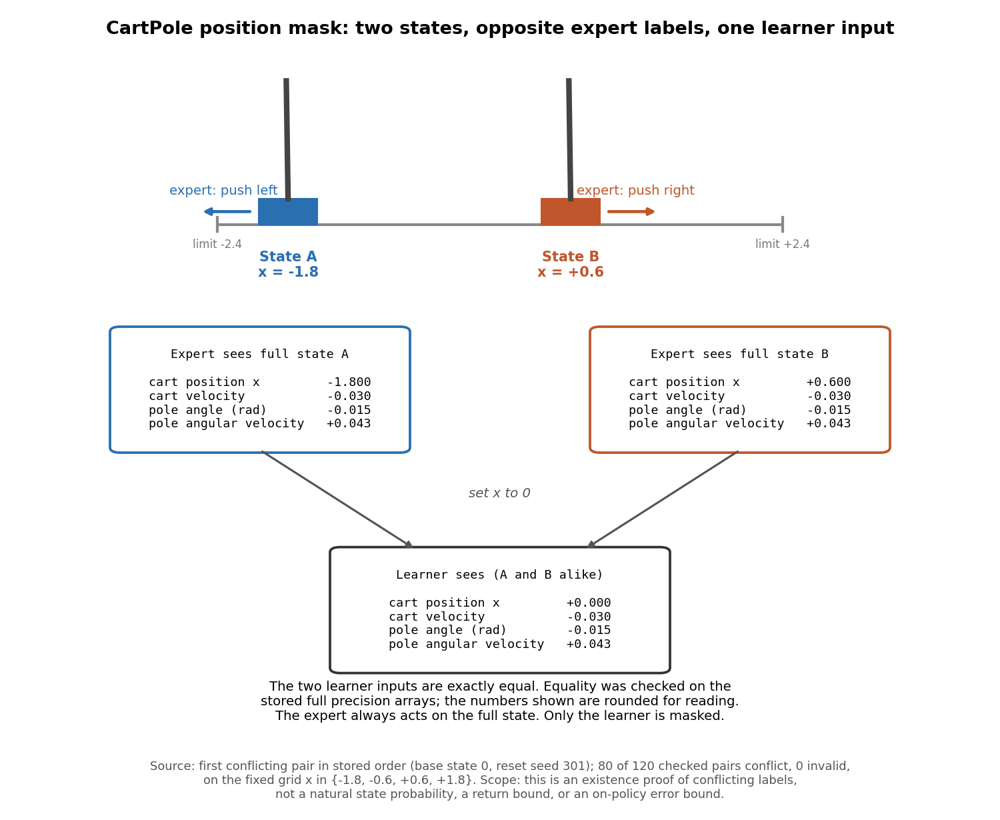

# CartPole restriction pilot: status

> **Correction: fixed BC.** The two historical jobs labelled fixed BC each
> performed 101 growing-prefix fits (1, 10, 20, ..., 1,000 labels), each
> evaluated and checkpointed. They were therefore not the requested baseline,
> a single offline BC fit on the whole 1,000-label pool. Corrected reporting
> in [`CARTPOLE_PILOT_RESULTS.md`](CARTPOLE_PILOT_RESULTS.md) uses only each
> job's stored full 1,000-label fit and its evaluation, drawn as a horizontal
> reference. BC-prefix and BC-pool are not active comparisons and get no extra
> plots. The actual historical cost is retained: the worker time and counts
> below include all 101 fits and evaluations per job. The 640-label common
> budget is unchanged when computed from the four FTL and BC-iid curves only;
> offline BC at 1,000 labels is not label matched to it. Mentions below of
> fixed-BC prefixes or curves describe the historical execution.
>
> This remains the status of the historical pilot with the cart-position-only
> (x-only) mask. It is not the new stronger-mask run, which has not run; its
> protocol is being prepared separately in a new document.

Final status: all six pilot jobs are terminal as of September 30, 2026,
6:17 pm Phoenix time (October 1, 01:17 UTC).

This note is the terminal status of the paired CartPole restriction pilot
described in [`CARTPOLE_PILOT_PROTOCOL.md`](CARTPOLE_PILOT_PROTOCOL.md). The
results report is [`CARTPOLE_PILOT_RESULTS.md`](CARTPOLE_PILOT_RESULTS.md).
[`STUDY_RESULTS.md`](STUDY_RESULTS.md) and
[`EXPLAINER_BINS_AUDIT_TOY.md`](EXPLAINER_BINS_AUDIT_TOY.md) are earlier dated
snapshots and are left unchanged.

## What is done: the position mask audit

The restriction `cart_position_zero` shows the learner every CartPole
observation with the cart position x replaced by 0. The expert is not
restricted: it always labels the full, unmasked state.

The audit asks a narrow question: under this mask, are there two valid states
that the learner cannot tell apart but that the expert labels differently?

- **Setup.** 20 base states taken from one expert episode (reset seed 301).
  For each base, x was set to each value on a fixed grid
  {-1.8, -0.6, +0.6, +1.8} with the other three coordinates unchanged, and the
  expert labelled each resulting full state. Every pair of grid values within
  a base gives 20 x 6 = 120 pairs.
- **Result.** 120 pairs checked, 80 conflicting, 0 invalid. A conflicting pair
  has identical masked observations and different expert actions.
- **Verification.** An independent operator gate confirmed status complete,
  scheduler exit 0, artifact SHA-256
  `f803629e71dc7e87b0bff4c81f30ea05f38c0c3946fa4240da327f7c2cd58b91`, the
  source fingerprint (source commit `2896ffe`), and every conflicting pair.



The figure shows the first conflicting pair in stored order (base state 0,
x = -1.8 and x = +0.6). The expert pushes left in one state and right in the
other, yet the learner receives exactly the same input for both. Equality was
checked on the stored full precision arrays; the figure rounds numbers only
for reading.

### How to read the counts

The 80 of 120 figure describes the chosen diagnostic grid. It is **not** a
probability that such states occur naturally, and it is **not** an error floor.
The audit is an existence proof: no deterministic policy of the masked
observation can match the expert on both states of a conflicting pair. It
bounds neither return nor on-policy imitation error, and no labels from the
audit are used for training.

## Training data

The data preparation job completed with exit 0. Result, source, expert and
dataset hashes were independently checked. The two offline datasets each
retain 1,000 labels, but their acquisition is different:

| Dataset | Complete expert episodes | Environment steps | Retained labels |
| --- | ---: | ---: | ---: |
| Fixed BC chronological pool | 2 | 1,000 | 1,000 |
| BC-iid independent-episode stream | 1,000 | 500,000 | 1,000 |

Their content hashes differ, so fixed BC and BC-iid do not share data. Within
each of these two methods, the full and masked runs consume the same
respective fixed pool or stream. FTL data are not shared: each FTL learner
collects expert labels on its own visited states, so the full and masked FTL
runs train on different states. The original normalization measurement used
500 expert and 500 random episodes, yielding returns 500.0 and 22.95.

## Terminal status of the learning runs

| Method | Full observations | Cart position hidden |
| --- | --- | --- |
| Fixed BC | Complete, 1,000 labels | Complete, 1,000 labels |
| FTL | Timed out; last saved training labels 646, last evaluation 640 | Timed out; last saved training labels 717, last evaluation 710 |
| BC-iid | Timed out; last saved training labels 670, last evaluation 670 | Timed out; last saved training labels 690, last evaluation 690 |

The four FTL and BC-iid jobs were stopped by the external two-hour limit. The
controller ended, and the remote tmux session was independently verified as
ended. No job was restarted and no limit was extended. The four timeout JSON
snapshots still say `running`, with `snapshot.final=false`; the campaign
inventory is authoritative for their terminal `timed_out` status. Saved counts
cover only the last snapshot, not unrecorded work before termination.


The curves and their interpretation are in
[`CARTPOLE_PILOT_RESULTS.md`](CARTPOLE_PILOT_RESULTS.md). Curves for the four
timed-out jobs are partial snapshots, not verified complete results. The
largest evaluation budget present in all six saved curves is 640 labels, so
no six-way comparison at 1,000 labels exists.

**All saved post-training evaluations hit the return ceiling.** Every saved
post-training evaluation of all six runs contains 100 episode returns of 500.
This ceiling on the observed return metric cannot show an FTL return
advantage, and it is not evidence of one. The independent Codex and verified
Opus 5.5 reviews found no evidence of an expert-head or evaluation-policy
mix-up. Saved heads changed during training and differ from the expert;
frozen feature weights equal the expert's, as the protocol requires.
Reloading a saved masked checkpoint preserves identical logits for inputs
that differ only in cart position. The role of the inherited expert features
is a plausible explanation for the ceiling, not a measured causal conclusion.

### Worker time

| Component | Worker-seconds |
| --- | ---: |
| All six learner attempts | 35,444.57 |
| Shared audit (charged once) | 3.51 |
| Data preparation (charged once) | 312.47 |
| **Total** | **35,760.55** |

The total is 9.93349 worker-hours. Of the learner time, the two completed BC
jobs used 6,643.72 seconds and the two timed-out FTL jobs used 14,400.35
seconds. Worker time is summed across jobs; it is not elapsed time, GPU hours
or money.


### Artifact verification

A separate independent artifact audit preserved all 8,732 artifact files and
independently rehashed the source, config, expert, result and data
fingerprints. It verified all 202 fixed BC and 138 BC-iid evaluated prefixes,
and the scratch data. The report generator does not repeat that audit; it
performs only the narrower checks listed in the Provenance section of
[`CARTPOLE_PILOT_RESULTS.md`](CARTPOLE_PILOT_RESULTS.md).

Forward-pass-only checks of every stored FTL label matched the full-state
expert: 648 full and 720 masked samples, with zero mismatches. These scratch
sample counts exceed the saved progress (646 and 717 labels); the additional
scratch samples do not prove that the corresponding fits completed.

### Optimizer mismatch and interpretation limits

The previous pipeline gives FTL and BC-iid minibatches of one throughout
these runs, while fixed BC uses up to 32. It also fits the round-loop methods
after every label, while fixed BC fits only the 101 plotted prefixes. Thus
fixed BC and BC-iid differ in optimizer work as well as data acquisition.
This was preserved pipeline behavior, but it is material, remains a
limitation on every comparison in this pilot, and must not be silently
changed as a runtime-only adjustment.

For example, at the 300-label full-observation fit, the recorded 20 epochs
imply 6,000 optimizer steps for FTL/BC-iid versus 180 for fixed BC. These
counts are derived from source and recorded epochs, not separate optimizer
instrumentation. Per-phase timers cover different work and are not clean
optimizer benchmarks.

Two additional limits apply to analysis. Evaluation episodes are not paired
across runs, and later round-loop head initializations can diverge because
collection and fitting consume random numbers differently. For each method,
the initial head matches across observation conditions; for fixed BC and
BC-iid (not FTL), the training data also match. Neither establishes common
randomness at all later rounds. On-policy cross-entropy and disagreement describe each
learner's own visited states.

For a timed-out job, the stored in-flight operation text can lag by a round.
It must not be used to infer the exact operation at termination. Final wall
time comes from the controller; work after the saved snapshot is unknown.

## Next steps and authorization

The completion monitor will be paused when the report is delivered. No scientific
changes, retries or wider runs are authorized. Consultation is required
before any new run that applies an effective minibatch correction or changes
the restriction, training settings (including budget) or evaluation settings
(including the episode limit). Read-only diagnosis of existing artifacts
remains authorized.

## Files

- Results report: [`CARTPOLE_PILOT_RESULTS.md`](CARTPOLE_PILOT_RESULTS.md).
- Learning curves:
  [`results/cartpole_pilot_learning_curves.png`](results/cartpole_pilot_learning_curves.png).
- Costs: [`results/cartpole_pilot_costs.png`](results/cartpole_pilot_costs.png).
- Machine-readable outputs:
  [`results/cartpole_pilot_summary.json`](results/cartpole_pilot_summary.json)
  and
  [`results/cartpole_pilot_curve_points.json`](results/cartpole_pilot_curve_points.json).
- Audit figure: `results/cartpole_position_mask_witness.png`. It is drawn only
  from the verified audit record and does not rerun the audit or roll out any
  environment. Earlier figures are unchanged.

### Reproducing the report

The report and the four result files come from the analysis-only generator
[`analyze_cartpole_pilot.py`](analyze_cartpole_pilot.py):

```bash
python experiments/agnostic/analyze_cartpole_pilot.py \
    --input-root INPUT --output-dir NEW_OUTPUT
```

`INPUT` is the preserved private pilot root, and `NEW_OUTPUT` must not already
exist. The generator only reads saved records; it never launches jobs or loads
checkpoints.
