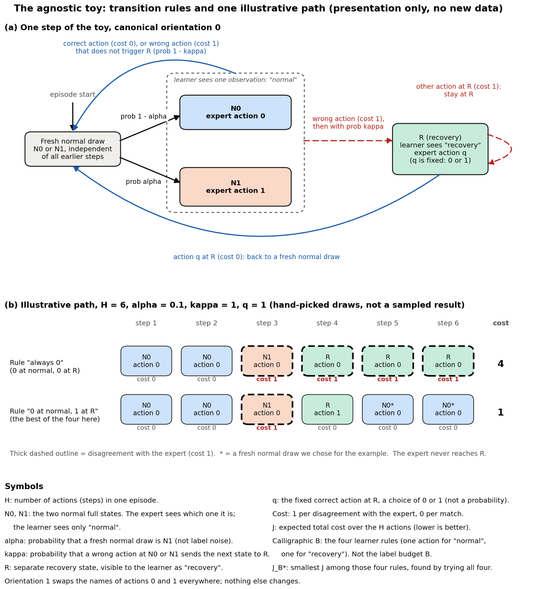

# Plain-language explainer: bins, the misspecification audit, and the toy

Status snapshot: 2026-09-30 22:05 UTC, before the approved pilot launch.

Newer: the CartPole pilot status is in
[`CARTPOLE_PILOT_STATUS.md`](CARTPOLE_PILOT_STATUS.md).

This note explains three parts of [`STUDY_RESULTS.md`](STUDY_RESULTS.md) that
earlier drafts described with too much jargon: the coarse-observation table
learner used in the classical diagnostic, the held-out audit and its lower
bound, and the controlled toy. It adds no new data. Every number quoted from
the study is copied unchanged from the existing results. Examples marked
*illustrative* were written by hand for teaching and are not study results.

Facts were checked against the source:
[`quantized.py`](../../src/imitation/experiments/agnostic/quantized.py) (bins,
table learner, audit bound),
[`classical.py`](../../src/imitation/experiments/agnostic/classical.py)
(audit sampling), and
[`toy.py`](../../src/imitation/experiments/agnostic/toy.py) (toy dynamics).

Contents:

1. [The bin-based diagnostic for CartPole](#1-the-bin-based-diagnostic-for-cartpole)
2. [The coarse-observation table learner](#2-the-coarse-observation-table-learner)
3. [The held-out misspecification audit](#3-the-held-out-misspecification-audit)
4. [The controlled toy, from scratch](#4-the-controlled-toy-from-scratch)
5. [Why interaction can help in the toy, and the honest controls](#5-why-interaction-can-help-in-the-toy-and-the-honest-controls)

A naming note: raw result files and code still use historical identifiers
such as `exact` fits, `fixed_bc`, and quantizer names. Those identifiers are
not renamed. In prose we say *bin-based diagnostic* for the classical study
and *coarse-observation table learner* for its learner.

---

## 1. The bin-based diagnostic for CartPole

CartPole gives four measurements at each step: cart position `x`, cart
velocity `x_dot`, pole angle `theta` (in radians), and pole angular velocity
`theta_dot`. The expert policy always sees all four. The learner in the
bin-based diagnostic sees only a *bin id*: a small integer that says which
coarse region the current measurements fall into.

### Cut points, not clipping and not a min/max range

The numbers listed for each measurement are **cut points**. They split the
real line into pieces. They are not clipping limits (no value is changed), and
they are not the minimum and maximum of the measurement.

For the **severe** representation:

- Cart position `x` has cut points -0.4 and 0.4, which give three bins:
  - `x < -0.4`, that is, (-infinity, -0.4)
  - `-0.4 <= x < 0.4`, that is, [-0.4, 0.4)
  - `x >= 0.4`, that is, [0.4, infinity)
- Pole angle `theta` has cut points -0.05 and 0.05 radians, which give
  `theta < -0.05`, `-0.05 <= theta < 0.05`, and `theta >= 0.05`.
- A value exactly equal to a cut point goes to the bin on its right. So
  `x = 0.4` is in the rightmost bin, and `x = -0.4` is in the middle bin.
- The two outer bins of each measurement cover every remaining value the
  environment produces, however large. (CartPole itself ends an episode once
  `|x|` exceeds 2.4 or `|theta|` exceeds about 0.2094 radians (12 degrees),
  and caps an episode at 500 steps, so in practice
  the outer `x` bins hold values out to about 2.4 in size. That limit comes
  from the environment, not from the bins.)
- Three `x` bins times three `theta` bins gives **9 bins**. Both velocities
  are ignored.

For the **mild** representation, two more yes/no features are added: the
sign of `x_dot` and the sign of `theta_dot` (cut point 0; a velocity of
exactly 0 counts as non-negative). That is 9 x 2 x 2 = **36 bins**.

In code the bin id is a mixed-radix number with `x` most significant, for
example `bin = 3 * x_bin + theta_bin` for severe. Nothing in this report
depends on the numbering.

### How this differs from the approved neural pilot

The user has approved (only) the initial six-run CartPole pilot described in
[`PIPELINE_RESTRICTION_PROPOSAL.md`](PIPELINE_RESTRICTION_PROPOSAL.md). It
uses a different restriction and a different learner:

| | Bin-based diagnostic (finished, this report) | Approved CartPole pilot (being implemented, not run) |
| --- | --- | --- |
| What the learner sees | a bin id only (9 or 36 possible values) | the four measurements with `x` replaced by 0; `x_dot`, `theta`, `theta_dot` stay continuous and unchanged |
| Learner | a lookup table from bin id to action | the previous pipeline's frozen expert features plus a trainable linear head |
| Fitting | majority vote per bin, no gradient steps | the previous pipeline's gradient training, learning rate 1e-3 |

No result from the pilot exists yet.

## 2. The coarse-observation table learner

**Memoryless.** The learner's action depends only on the current bin. It does
not see earlier observations, earlier actions, or any other history. So a
policy in this class is just a table: one action per bin.

**Exact majority table.** Given a set of expert-labeled examples, the learner
counts, in each bin, how often the expert chose each action, and assigns the
bin the most common label. Ties go to the lowest action id, and a bin with no
data gets action 0.

Example (*illustrative*): a bin holds 10 examples, 7 labeled "push left" and
3 labeled "push right". The table picks "push left" for that bin and gets 3 of
those 10 examples wrong. No table can do better on these examples, because a
table must give that bin one action, and either choice is wrong on at least 3
of them.

Doing this in every bin gives the table with the **fewest sample 0-1 errors
(label disagreements) among all possible tables**. That is what "exact 0-1
empirical risk minimization" means here, and it is all it means:

- It is exact only about the counting objective on the collected labels.
- It is **not** a return-optimal policy. Matching the expert's labels as often
  as possible is a different goal from keeping the pole up as long as
  possible, and no return-optimal table was computed.
- So the low classical returns (for example CartPole severe near 32 against
  the expert's 500) do not show what the best possible bin policy could
  achieve.

## 3. The held-out misspecification audit

**Question.** Is the expert really outside the learner's class? That is, does
*every* possible table disagree with the expert on a positive fraction of
states? If yes, the setting is *misspecified* (agnostic) for that
distribution of states.

### The reference data

- For each environment, 4096 **independent** episodes were run. Each episode
  was independently chosen, with probability one half, to be driven by the
  expert or by uniformly random actions. For CartPole this gave 2008 expert
  and 2088 random episodes.
- From each episode, **one** pre-action state was chosen uniformly at random,
  and the expert labeled it. One state per independent episode keeps the 4096
  examples independent of each other, which the bound below requires.
- These audit labels were **held away from training**. No learner saw them.
- Together they define the *reference distribution*: half expert-driven and
  half random episodes, one uniformly chosen state each. The bound is about
  this distribution only.

### Four quantities

Write K for the number of bins (9 or 36), A for the number of actions (2 in
CartPole), and n for the number of reference examples (4096).

1. **Empirical floor.** Fit the exact majority table to the reference data,
   and record the fraction it gets wrong:

   `floor = (n - sum over bins of the largest action count in that bin) / n`

   This is the smallest sample disagreement any table can reach on these
   4096 examples (Section 2).

2. **Finite-sample slack.** A sample of 4096 can make a table look worse
   than it really is: its sample disagreement can overstate its true
   disagreement on the reference distribution, which would make imitation
   look harder than it is. The slack is an allowance for that. The lower
   bound needs the one-sided event that, for every table h, the true
   disagreement of h is at least the sample disagreement of h minus the
   slack. Subtracting the slack keeps us from overclaiming unavoidable
   population error from a finite sample. The slack comes from Hoeffding's
   inequality plus a union bound over all A^K tables:

   `slack = sqrt((K log A + log(1 / delta)) / (2 n))`

   Empty bins still count in K, so the bound covers every possible table.

3. **Lower confidence bound.**

   `lower bound = max(0, floor - slack)`

   With probability at least 1 - delta over the draw of the reference sample,
   **every** table disagrees with the expert on at least this fraction of the
   reference distribution. A positive lower bound is the misspecification
   certificate.

4. **delta.** A chosen upper bound on the probability that this statistical
   guarantee fails, that is, that the random reference sample was unlucky
   enough to make the bound wrong. The true failure probability is at most
   delta, not exactly delta. It is **not** the probability of a mistake at a
   given state. The code fixes
   `delta = 0.05 / 6` (about 0.00833). The six matches the six quantizers
   predeclared in `quantized.py` before any data were seen (mild and severe
   for CartPole, Acrobot, and the MountainCar backup), so the familywise
   failure chance is at most 0.05. MountainCar's expert failed to train, so
   only four bounds were computed, but delta stays at 0.05 / 6. Changing it
   afterward to 0.05 / 4 would be a retroactive, results-aware change.

### Worked example: CartPole severe (from the raw audit record)

Of the 9 bins, 6 received reference examples. The central bin
(`-0.4 <= x < 0.4` and `-0.05 <= theta < 0.05`) held 1518 "push left" and
1481 "push right" labels, so any table is wrong on at least 1481 examples
there. Across all bins the majority table is wrong on 1485 of 4096 examples.

| Quantity | Value |
| --- | --- |
| Empirical floor | 1485 / 4096 = 0.362549 |
| Slack, with K = 9, A = 2, n = 4096, delta = 0.05 / 6 | sqrt((9 log 2 + log 120) / 8192) = 0.036687 |
| Lower bound | 0.362549 - 0.036687 = 0.3258619797 |

These values were recomputed from the stored counts with the formulas above
and match the raw record.

### What the bound does and does not say

- It **does** say: on the reference distribution, every severe-bin table
  disagrees with the expert on at least about 32.6% of states (with the
  stated confidence).
- It does **not** bound disagreement on the states that a particular learner
  visits, which can be a very different distribution.
- It does **not** bound return, and it does not say how far below the
  expert's return a bin policy must fall.
- It does **not** guarantee that FTL-DAgger beats BC-iid.

### A different kind of check for continuous masks

The approved CartPole pilot hides `x` but keeps the other measurements
continuous, so there are no bins to count. The planned mask check there is a
**conflict existence test**: find simulator-valid states that look identical
to the learner after the mask but get different expert actions. Finding such
a pair shows that no deterministic policy of the masked observation can match
the expert everywhere. It has a narrower scope than the audit above: it does
not give a formal lower bound on disagreement under any state distribution,
and none is promised.

## 4. The controlled toy, from scratch

*Presentation-only diagram drawn from the rules in `toy.py`. Panel (b) uses
hand-picked random draws and is not a sampled result.*

### Symbols, defined before use

- **H**: the number of actions (steps) in one episode.
- **N0 and N1**: the two *normal* full states. The expert sees which one it
  is in. The learner does not: both look like the same observation,
  "normal".
- **alpha**: the probability that a fresh normal draw is N1 (otherwise N0).
  It is a property of the state distribution, not label noise. The expert's
  labels are always correct.
- **Normal actions**: at N0 the expert takes action 0; at N1 it takes
  action 1.
- **R**: a separate *recovery* state. The learner can tell it apart from
  normal (its observation is "recovery").
- **kappa**: the probability that a wrong action at N0 or N1 sends the next
  state to R.
- **q**: the fixed correct action at R. It is a choice, 0 or 1, made per
  condition. It is **not** a probability.
- **Cost**: 1 for each action that disagrees with the expert, 0 for each
  that matches.
- **J**: the expected total cost over the H actions. Lower is better. The
  expert has J = 0.
- **Calligraphic B** (the learner class): the four deterministic rules that
  choose one action for "normal" and one action for "recovery". This is
  unrelated to the letter B used elsewhere for the label budget.
- **J_B\***: the smallest J among those four rules.

### The rules of one step (from `toy.py`)

- An episode starts at a fresh normal draw: N1 with probability alpha,
  otherwise N0. It never starts at R.
- At a normal state:
  - a **correct** action costs 0, and the next state is a fresh, independent
    normal draw;
  - a **wrong** action costs 1. With probability kappa the next state is R.
    Otherwise (probability 1 - kappa) the next state is again a fresh normal
    draw.
- At R:
  - action **q** costs 0, and the next state is a fresh normal draw;
  - the other action costs 1, and the system **stays at R**.
- After the H-th action the episode ends.

Because the learner sees N0 and N1 as one observation, every rule in
Calligraphic B takes the same action at both, so it is wrong at one of them.
When alpha > 0, even the best rule has a positive cost. The best rule takes
action 0 at "normal" (since N0 is more common; the code requires alpha below
0.5) and action q at "recovery".

### Why J_B\* is not simply H times alpha

J_B\* is computed exactly by evaluating all four rules and taking the
smallest (`class_costs` in `toy.py`). It is usually not H x alpha: under the
best rule, a mistake at N1 (with kappa = 1) moves the system to R for one
step, and that step is spent at R instead of at a normal state. The share of
time spent at normal states changes, so the count of normal mistakes
changes. For example, the report's J_B\* for H = 16, alpha = 0.1, and
kappa = 1 is 1.4628, not 1.6. That value holds only for kappa = 1. With
kappa = 0 a mistake never leads to R, every state is a fresh normal draw, and
J_B\* is exactly H x alpha.

### Illustrative path: H = 6, alpha = 0.1, kappa = 1, q = 1

*Illustrative, hand-picked draws; not a new sampled result.* Suppose the first
three normal draws are N0, N0, N1 (panel (b) of the figure).

- **Rule "always 0"** (0 at normal, 0 at R): steps 1 and 2 are correct. At
  step 3 (N1) action 0 is the unavoidable normal mistake (cost 1), and since
  kappa = 1 the next state is R. At R action 0 is wrong (q = 1), so it costs
  1 and the system stays at R, three times. Total cost 4.
- **Rule "0 at normal, 1 at R"**: the same mistake at step 3 (cost 1), then
  action 1 at R is correct (cost 0) and escapes to a fresh normal draw.
  Suppose steps 5 and 6 are N0. Total cost 1.
- **The expert** takes action 1 at step 3, never enters R, and costs 0.

For these settings, an exact calculation with the toy's own evaluator (done
only for this explainer, not a recorded study output) gives J = 1.7830 for
"always 0" and J = 0.5537 for "0 at normal, 1 at R". The latter is J_B\*,
which is below H x alpha = 0.6 for the reason above.

## 5. Why interaction can help in the toy, and the honest controls

### Expert-only data never contain R

The expert never makes a mistake, so an expert-driven episode never enters R.
BC-iid (one uniformly chosen state from each independent expert episode)
therefore never receives a label at R. Its action for "recovery" comes from
the data-free default: the lowest action id, which is canonical action 0.

### FTL-DAgger's own rollouts can reach R

FTL-DAgger lets the current learner act and asks the expert to label one
uniformly chosen state from each episode. The learner's unavoidable mistake at
N1 sends it to R (when kappa > 0), and when the chosen state is at R the
expert's label there is q. Every label at R is q, because the expert is
deterministic, so once at least one retained label falls at R, the majority
table picks q at "recovery".

This is an opportunity, not a guarantee for every finite run. Learning q
requires that FTL-DAgger's retained samples actually include an R state,
which depends on the learner making the normal mistake, reaching R, and the
randomly chosen label time landing there. Its normal action also depends on
the retained normal labels having the expected majority (more N0 than N1).

### Why the q = 1 case carries the whole effect

The structural difference is simple: with **q = 0** both methods start with
the correct action at R (the default guess, action 0), and with **q = 1**
they start with the wrong one. Only with q = 1 is there something at R for
interaction to fix. BC-iid, which never sees R, keeps that starting action.

What was **observed** is a separate, finite-run statement. In the recorded
primary runs (kappa = 1, alpha in {0.02, 0.1, 0.3}, H in {16, 64}, budget
4096 labels, 100 seeds, both orientations):

- with q = 0, BC-iid and FTL-DAgger ended with the same rule, and the paired
  difference was exactly 0;
- with q = 1, FTL-DAgger ended with action q at R (its final class excess
  was 0), while BC-iid kept the wrong action at R.

These are recorded results at the reported budget, not a guarantee for every
finite sample; a run whose retained samples never covered R, or whose
normal labels had an unusual majority, could end differently. In the
report's primary table, BC-iid's class excess is the average over q = 0 and
q = 1, for example (0 + 7.2049) / 2 = 3.6025 at H = 16, alpha = 0.1, and
kappa = 1.

### The honest controls

- **Both values of q** are included, so the result is not tuned to the case
  where interaction helps. With q = 0 the recorded method comparison was
  exactly zero at the reported budget.
- **Both action orientations** are included. Orientation 1 swaps the names of
  actions 0 and 1 everywhere (expert labels, the default guess, and the tie
  rule move together), so the result does not depend on which physical
  action happens to be called 0. The recorded results passed the
  orientation invariance check.
- **kappa = 0**: a wrong normal action never leads to R, so nobody visits R.
  In the recorded runs the final FTL-DAgger and BC-iid policies matched
  exactly (the toy shares random draws between the methods, and with
  kappa = 0 both see the same normal states).
- **alpha = 0**: N1 never occurs, so there is no ambiguity and the setting is
  realizable (a rule in the class can match the expert).

### What the toy cannot show

- In the toy, every normal state is an independent fresh draw. Expert data
  therefore have no temporal correlation: a chronological run of expert
  states has the same statistics as one state per independent episode. So
  the toy **cannot** show any penalty (or benefit) from correlated expert
  data, that is, any difference between the intended fixed BC and BC-iid.
- The intended fixed BC (a chronological prefix of one expert collection) is
  still missing from the old toy outcomes. The toy's recorded `bc_fixed` field
  is the BC-iid refit alias described in
  [`STUDY_RESULTS.md`](STUDY_RESULTS.md#the-fixed-bc-error).
- The toy supports only a narrow mechanism: interaction helps when the
  learner's unavoidable mistakes lead to a recoverable state whose correct
  action cannot be inferred from expert-only data.
