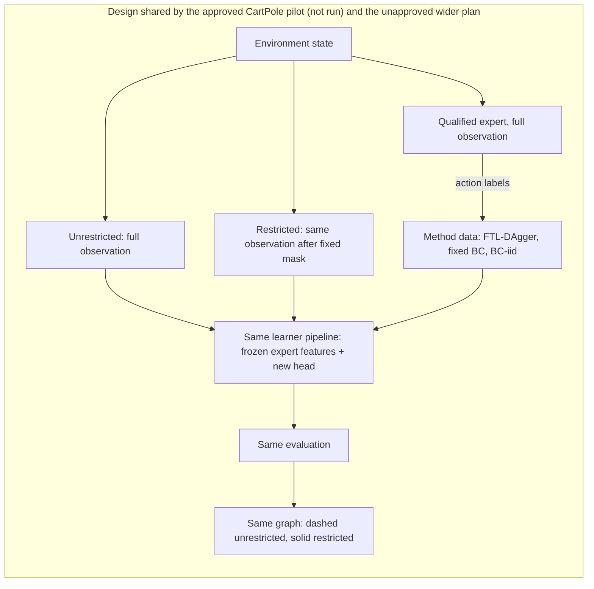
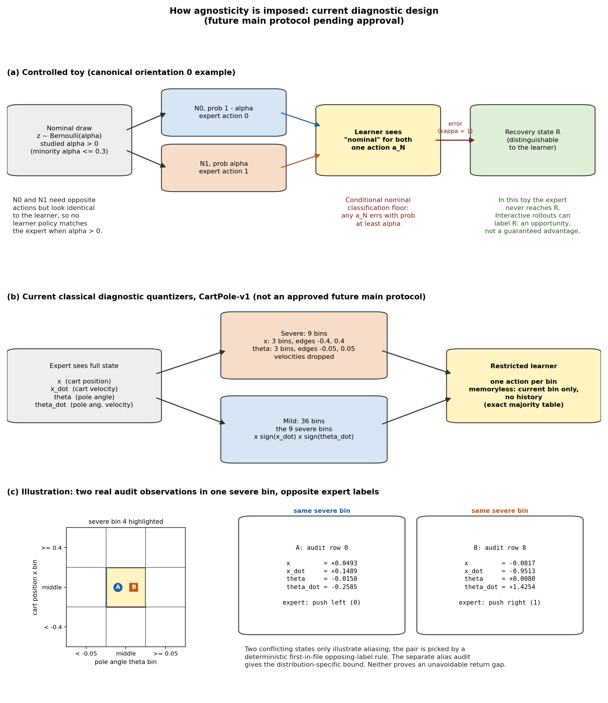
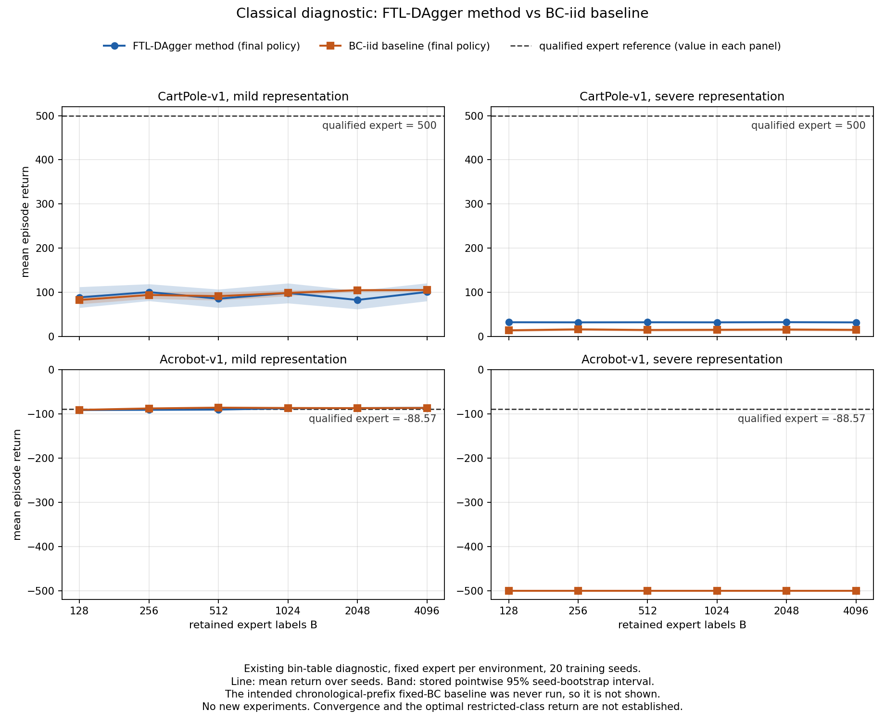
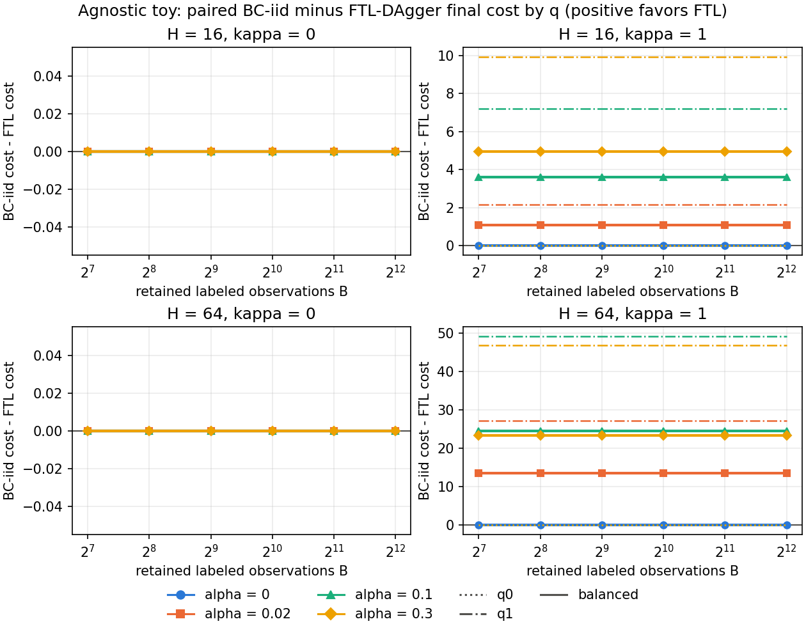

# Agnostic imitation study: current diagnostic status

Status snapshot: 2026-09-30 22:05 UTC, before the approved pilot launch.

Newer: the CartPole pilot status is in
[`CARTPOLE_PILOT_STATUS.md`](CARTPOLE_PILOT_STATUS.md).

> **This is a diagnostic status report, not final results.**
>
> - **The intended fixed BC was never run.** What the code and earlier drafts
>   called "fixed BC" is a refit of BC-iid's own first B labels, evaluated by
>   reusing BC-iid's evaluation. It is an alias of BC-iid, equal to it by
>   construction (see [The fixed-BC error](#the-fixed-bc-error)).
> - **No new experiments have been run** since that error was found. Every
>   number below comes from the existing, immutable raw results and analysis
>   reports.
> - **Approved: only the initial six-run CartPole pilot.** On 2026-09-30 the
>   user approved the first CartPole step of
>   [`PIPELINE_RESTRICTION_PROPOSAL.md`](PIPELINE_RESTRICTION_PROPOSAL.md)
>   (one seed, 3 methods x {full, `x` hidden}) and the implementation and
>   gates it needs. It is being implemented. **It has not run, and no result
>   from it exists.** Still **not approved**: the wider eight-environment
>   pilot and main campaign, any other mask, any time-limit (cap) change,
>   hyperparameter tuning, and the numeric budget and plateau rules. The
>   separate fixed-BC correction proposal
>   ([`BC_CORRECTION_AMENDMENT.md`](BC_CORRECTION_AMENDMENT.md)) is not
>   authorized for execution either. Settled by the user as direction for
>   future work: reuse the previous learned-policy pipeline wherever
>   possible, comparing runs with and without a learner-only restriction
>   while changing as few variables as possible; target all 8 original
>   classical environments if feasible; show restricted and unrestricted
>   runs in the same graphs, one color per method, solid for restricted and
>   dashed for unrestricted; and train long enough for the restricted
>   learning curves to plateau. See
>   [Next comparison](#next-comparison-cartpole-pilot-approved-wider-plan-not-approved).
> - **New to this report?** The bins, the audit bound, and the toy are
>   explained step by step, with every symbol defined, in
>   [`EXPLAINER_BINS_AUDIT_TOY.md`](EXPLAINER_BINS_AUDIT_TOY.md).
> - Episode length: the user asked to consider both longer training (more
>   episodes, labels, or updates) and longer environment episode time
>   limits. Any time-limit comparison would apply the same cap to all
>   methods and both restriction conditions, treat the cap as a factor
>   separate from the mask, re-evaluate the expert and random normalization
>   references at the new cap, and distinguish timeouts from natural
>   terminal failures. No cap changes automatically, and none is
>   implemented; the approved pilot keeps the original 500-step CartPole
>   limit. Still requiring consultation: masks beyond the pilot's CartPole
>   `x := 0`, the exact time limits, the numeric training budget, the
>   plateau criterion, and other numeric settings.
> - The presentation-only figures below (two plots of existing diagnostic
>   data and one teaching diagram of the toy's rules) were made locally.
>   The scientific campaign ran separately on private remote compute, not
>   described here. No unrestricted-learner curve exists or is shown.

What remains valid: the FTL-DAgger versus BC-iid comparison, its uncertainty,
the cost accounting, the recorded failures, and the reproduction evidence.
The original pre-execution design is in
[`../AGNOSTIC_EXPERIMENT_PLAN.md`](../AGNOSTIC_EXPERIMENT_PLAN.md), and public
commands are in [`README.md`](README.md).

## The fixed-BC error

- **Intended fixed BC.** Roll the expert out once, in a single collection
  pass of complete episodes, until the maximum budget of transitions is
  reached. Keep every state of those episodes in chronological order, and at
  each budget B fit the first B transitions of that fixed dataset.
- **What was executed.** The "fixed BC" fit the first B labels of the BC-iid
  stream (one uniformly selected state from each of B independent expert
  episodes) with the same fitting rule, and reused BC-iid's evaluation. That
  is BC-iid again. Raw records name it `fixed_bc`; it should be read as
  `bc_iid_refit_alias`.
- **Consequences.** Earlier drafts described several "fixed BC points" per
  plot, called the equality with BC-iid a valid control, and presented a
  third method. All three statements were wrong. The equality holds only
  because the same data were fitted twice, so it tests nothing about fixed
  BC. The alias is removed from every table and figure in this report. The
  earlier classical figure that shows its markers,
  [`results/classical_return_vs_retained_labels.png`](results/classical_return_vs_retained_labels.png),
  is preserved unchanged but no longer displayed.
- **Not affected.** FTL-DAgger and BC-iid were collected and evaluated
  independently of the alias, so their comparison stands.

## Main hypothesis

With deliberate policy-class misspecification, states visited by the learner
can teach recovery behavior that expert-only data miss, which may improve
performance or sample efficiency. This need not hold in every environment,
and it need not reach the qualified expert's return (qualifying a trained
expert does not prove it is globally optimal). Testing it against expert
data requires keeping two kinds of expert data apart: a fixed chronological
expert prefix (fixed BC) and independent one-state-per-episode samples
(BC-iid). Only the second was actually run.

## Next comparison: CartPole pilot approved, wider plan not approved

> **Only the initial six-run CartPole pilot is approved. It is being
> implemented and has not run. No result exists for it.** Everything else in
> this section (the other seven environments, other masks, caps, tuning,
> budgets, and the main campaign) is a proposal that is not approved. The
> figures in this report show only existing bin-based diagnostic data and
> one teaching diagram.
>
> The approved pilot: CartPole-v1, one excluded seed (300), methods
> FTL-DAgger, fixed BC, and BC-iid, each under full observation and under a
> learner-only mask that replaces cart position `x` with 0 while `x_dot`,
> `theta`, and `theta_dot` stay continuous and unchanged. That is six runs,
> with the settings fixed in section 7 of the proposal. This mask is not the
> bin representation used in the diagnostic below.

- **Pipeline.** Reuse the previous pipeline's default linear policy mode
  (frozen expert features plus a new trainable head). Keep the architecture,
  optimizer, loss, cold starts, fixed BC and BC-iid data definitions, and
  evaluation identical between conditions.
- **Only change.** A fixed learner-only observation restriction applied
  before the frozen features. The expert always acts on, and labels from,
  the full observation.
- **Methods.** FTL-DAgger, fixed BC, BC-iid. Optional FTL mixture evaluation
  off by default; BC pool and prefix variants off.
- **Charts.** Restricted and unrestricted in the same graph, same color per
  method, solid restricted, dashed unrestricted.
- **Environments.** All 8 targeted for the (unapproved) wider plan;
  feasibility per environment is unknown until checked. The approved pilot
  covers CartPole-v1 only.
- **Hypothesis.** Labels on learner-visited states can close a recovery gap
  under restriction. Assess FTL minus fixed BC and FTL minus BC-iid, with and
  without restriction. The design neither requires nor assumes that FTL
  wins.
- **Hiding a feature does not by itself guarantee agnosticity.** For a
  continuous mask such as `x := 0`, the planned check is a conflict
  existence test: find simulator-valid states that look the same to the
  learner after the mask but get different expert actions. That shows no
  deterministic masked policy can match the expert everywhere. Its scope
  differs from the bin audit below: it gives no formal lower bound on
  disagreement under any state distribution, and none is promised. Poor
  return is not evidence of agnosticity.
- **Status.** The CartPole `x := 0` mask is approved for the pilot only, and
  is not yet verified. All other candidate masks and numerical settings
  are not approved. Details are in
  [`PIPELINE_RESTRICTION_PROPOSAL.md`](PIPELINE_RESTRICTION_PROPOSAL.md).

## How this study relates to the previous protocol

The bin-based diagnostic changed the learner, the objective, the environment
set, and the evaluation, compared with the earlier learned-policy pipeline
(`experiments/run_learning_curves.sh`). It is a pilot and mechanism study,
**not a replacement for the 8-environment benchmark.**

| | Previous learned-policy pipeline | Bin-based diagnostic (this report) |
| --- | --- | --- |
| Environments | 8 classical: CartPole-v1, FrozenLake-v1, CliffWalking-v0, Acrobot-v1, MountainCar-v0, Taxi-v3, Blackjack-v1, LunarLander-v2 | 2: CartPole-v1, Acrobot-v1 |
| Seeds | 5 | 20 (1000..1019) |
| Data schedule | 1000 rounds, 1 sample per round | up to B = 4096 retained labels, 16 episodes per round, one label per episode |
| Learner | trained policy, learning rate 1e-3, up to 20 BC epochs per round, inner NLL early stopping on, outer early stopping off, no warm start, beta 0 | coarse-observation table learner: one action per bin, chosen by majority vote of the collected expert labels (fewest label disagreements, not best return); no learning rate, no gradient steps |
| Evaluation | every 10 rounds, 100 deterministic episodes, on states visited by the current policy | checkpoints B = 128, 256, ..., 4096, 100 episodes each |
| Metrics | normalized return, rollout cross-entropy, expert cross-entropy, disagreement | raw native return, reference disagreement, plus an FTL episode-level mixture |

**Environment selection.** The rule took the first two candidates, in the
predeclared order CartPole-v1, Acrobot-v1, MountainCar-v0, that passed expert
qualification, a positive misspecification bound, numerical stability, and
pilot runtime gates. The first two qualified, so the backup was not needed.
Its expert had already failed to train by the fixed 6,000,000-step cap; it
was preserved, not retried, and not used.

| Env | Expert qualification mean return | Threshold | Outcome |
| --- | --- | --- | --- |
| CartPole-v1 | 500.0 | 476.1 | qualified |
| Acrobot-v1 | -88.57 | -105.7 | qualified |
| MountainCar-v0 (backup) | n/a | n/a | expert training failed at the 6,000,000-step cap |

## The coarse-observation table learner: what it is, and is not

A step-by-step version, with examples, is in
[`EXPLAINER_BINS_AUDIT_TOY.md`](EXPLAINER_BINS_AUDIT_TOY.md) (sections 1
and 2).

- **Teacher and learner see different things.** The expert acts on the full
  environment state. The learner sees only a bin id, a small integer naming
  which coarse region the current measurements fall in.
- **CartPole bins are defined by cut points.** In the *severe*
  representation, cart position `x` has cut points -0.4 and 0.4, giving the
  bins (-infinity, -0.4), [-0.4, 0.4), and [0.4, infinity). Pole angle
  `theta` has cut points -0.05 and 0.05 radians, giving three bins the same
  way. A value exactly on a cut point goes to the bin on its right. The
  cut points do not clip values and are not a min/max range: the outer bins
  hold every remaining value the environment produces. Three times three
  gives 9 bins, and both velocities are ignored. The *mild* representation
  adds the signs of `x_dot` and `theta_dot` (zero counts as non-negative),
  giving 9 x 2 x 2 = 36 bins. (Acrobot uses the same idea with angle cut
  points at plus and minus pi/3.)
- **Memoryless.** The action depends only on the current bin: no earlier
  observations, earlier actions, or other history.
- **Majority table, not an optimal controller.** Each fit counts the expert
  labels in each bin and picks the most common one (ties go to the lowest
  action; empty bins get action 0). For example, a bin with 7 "left" and 3
  "right" labels gets "left" and 3 unavoidable errors. Doing this in every
  bin gives the fewest label disagreements on the collected data among all
  tables. That is the only sense in which the fit is exact. It does **not**
  solve the environment or maximize return, and no return-optimal table was
  computed.
- **Why the expert is outside the class.** Some states where the expert
  takes opposite actions fall in the same bin, and the table must give one
  action per bin, so it is wrong on some of them whatever it picks. This is
  not label noise: the expert is deterministic.
- **No learning rate and no optimization curve.** Differences between
  methods come only from the data each collects. A flat curve here is not a
  sign of convergence of a training process.
- **Low returns are not explained by agnosticity alone.** Because the fit
  targets label agreement rather than return, low returns (CartPole severe
  near 32 against the expert's 500, Acrobot severe at the -500 floor)
  **cannot be dismissed as the expected cost of agnosticity.** They may come from the objective or learner design as much
  as from the restriction.
- **The audit bound is about classification, not reward.** The bound below is
  a lower confidence bound on the minimum disagreement any bin-only policy
  can achieve on one reference state distribution. It is not a bound on each
  learner's own state distribution, and it is not an unavoidable return gap.
- **Not the approved pilot's restriction.** The approved CartPole pilot does
  not use bins. It replaces only `x` with 0 and keeps the other three
  measurements continuous, with a neural learner.

*Presentation-only figure (unchanged earlier image): the bin design and the
toy's observation-aliasing mechanism. It adds no new data. In panel (b),
"edges" means cut points as described above. The title's "pending approval"
predates the user's approval of the initial CartPole pilot; the wider design
is still unapproved. A clearer toy diagram is in the toy section below.*

## Misspecification audit (classical)

**Question.** Does *every* bin table disagree with the expert on a positive
fraction of states? If so, the expert is outside the learner class for that
distribution of states. A worked version is in section 3 of
[`EXPLAINER_BINS_AUDIT_TOY.md`](EXPLAINER_BINS_AUDIT_TOY.md).

**Unseen reference data.** For each environment, 4096 independent reference
episodes were run. Each episode was driven by the expert or by uniform
random actions, chosen with probability 0.5 (2008 expert and 2088 random
episodes per environment). Each contributes one uniformly chosen pre-action
state, labeled by the expert, so the 4096 examples are independent. Audit
labels were held away from training: no learner ever saw them.

**The four quantities** (K bins, A actions, n = 4096 examples; formulas as
implemented in `alias_lower_bound` in `quantized.py`):

- **Empirical floor** = (n - sum over bins of the largest action count in
  that bin) / n. It is the smallest sample disagreement any table can reach
  on the reference examples.
- **Finite-sample slack** = sqrt((K log A + log(1 / delta)) / (2 n)), from
  Hoeffding's inequality and a union bound over all A^K tables (empty bins
  included in K). It allows for any table looking worse on the sample than
  on the distribution. The lower bound needs, for every table, true
  disagreement at least sample disagreement minus slack, so subtracting the
  slack avoids overclaiming unavoidable population error from a finite
  sample.
- **Lower confidence bound** = max(0, floor - slack). With probability at
  least 1 - delta, every table's disagreement on the reference distribution
  is at least this value. A positive value certifies misspecification on
  that distribution.
- **delta** is a chosen upper bound on the probability that this
  statistical guarantee fails because of an unlucky reference sample (the
  true failure probability is at most delta, not exactly delta). It is not
  a per-state mistake probability.
  The code fixes delta = 0.05 / 6, matching six bounds predeclared before
  any data (mild and severe for CartPole, Acrobot, and the MountainCar
  backup), for a familywise failure chance of at most 0.05. Only four were
  computed because MountainCar's expert failed; delta was not retroactively
  changed to 0.05 / 4.

Example, CartPole severe: 1485 of 4096 reference examples are unavoidably
wrong (1481 of them in the central bin, which holds 1518 "left" and 1481
"right" labels), so the floor is 0.362549; the slack is 0.036687; the lower
bound is 0.3258619797.

| Env | Rep | Bins K | Empirical floor | Slack | Lower bound (delta 0.00833) |
| --- | --- | --- | --- | --- | --- |
| CartPole-v1 | mild | 36 | 0.1396 | 0.0603 | 0.0794 |
| CartPole-v1 | severe | 9 | 0.3625 | 0.0367 | 0.3259 |
| Acrobot-v1 | mild | 36 | 0.0945 | 0.0736 | 0.0209 |
| Acrobot-v1 | severe | 9 | 0.4380 | 0.0423 | 0.3957 |

All four bounds are positive, so all four conditions are misspecified on the
reference distribution. A separate local check re-queried both frozen experts
and reproduced all 8192 audit labels and all four bound values.

**Scope.** The bound applies only to this reference distribution (half
expert-driven and half random episodes, one uniformly chosen state each). It
is not a bound on the states any learner visits, it is not a bound on
return, and it does not guarantee that FTL-DAgger does better than BC-iid.

## Classical results: FTL-DAgger versus BC-iid

Methods: **FTL-DAgger** (the learner drives, the expert labels one selected
state per episode) and the baseline **BC-iid** (the expert drives, one
uniformly selected state per independent episode is kept). B counts retained
labels, not expert calls: at equal B, BC-iid spends about 500 (CartPole) or
85 (Acrobot) expert action entries per retained label, FTL-DAgger one. Equal
B is not an equal oracle budget.

Mean return at B = 4096 over 20 seeds, native units, higher is better, with
pointwise 95% seed-bootstrap intervals (10,000 resamples of whole seeds):

| Env | Rep | FTL final | BC-iid final |
| --- | --- | --- | --- |
| CartPole-v1 | mild | 100.65 [80.15, 120.71] | 105.11 [102.16, 108.10] |
| CartPole-v1 | severe | 31.82 [31.33, 32.32] | 14.83 [11.54, 18.40] |
| Acrobot-v1 | mild | -86.41 [-88.47, -84.39] | -86.42 [-88.14, -84.85] |
| Acrobot-v1 | severe | -500.00 (all seeds) | -500.00 (all seeds) |

Qualified expert references: CartPole-v1 500.0, Acrobot-v1 -88.57.

**Primary paired estimate**, FTL final minus BC-iid, paired by seed. Four
tests, Bonferroni level 98.75% (approximately 95% familywise):

| Env | Rep | Estimate | Pointwise 95% | Family 98.75% | Seed SD | Reading |
| --- | --- | --- | --- | --- | --- | --- |
| CartPole-v1 | mild | -4.46 | [-25.64, 16.29] | [-31.99, 21.76] | 49.53 | uncertain |
| CartPole-v1 | severe | +17.00 | [13.47, 20.16] | [12.48, 20.91] | 7.84 | FTL higher; both far below expert |
| Acrobot-v1 | mild | +0.01 | [-2.12, 2.06] | [-2.79, 2.59] | 4.90 | no clear difference; not equivalence |
| Acrobot-v1 | severe | 0 | [0, 0] | [0, 0] | 0 | floor failure (degenerate) |

*Presentation-only figure: FTL-DAgger final policy and BC-iid with the
qualified expert reference, uncertainty shown in the image. It uses only the
existing results and contains no fixed-BC or alias values.*

- **CartPole severe.** FTL higher in 19 of 20 seeds, and the family interval
  is above zero. FTL is roughly flat near 32 at every checkpoint, BC-iid near
  14 to 16. Both are far below 500: an advantage between two poor policies.
- **CartPole mild.** Per-seed differences split into two clusters, about +20
  to +52 (12 seeds) and about -40 to -74 (8 seeds). FTL's final-policy return
  also varies strongly across checkpoints.
- **Acrobot mild.** Both near -86, narrow interval including zero. No
  equivalence margin was prespecified. Closeness to the expert's -88.57
  (different episodes) is not evidence that either learner beats the expert.
- **Acrobot severe.** Every policy, checkpoint, and seed returned -500. One
  untested possibility is that the angle-only 9-bin observation removes
  information needed to swing up.

**What the intervals cover.** They condition on one frozen expert per
environment, the frozen bins, and the frozen reference sample, and resample
the 20 seeds, each evaluated on 100 episodes. Within-run Monte Carlo standard
errors of the paired seed mean are reported separately (CartPole mild 1.05,
severe 0.31, Acrobot mild 0.95, severe 0). Expert retraining variation is not
included. Coverage is approximate.

Secondary classical outputs (unadjusted, descriptive), including the FTL mixture

The FTL episode-level mixture samples one past behavior policy uniformly at
the start of each whole episode and follows it for the episode. It was
computed by the existing producers and is secondary. The user has asked that
mixture evaluation be **off by default** in future work; that is an intended
future default only. It is not implemented in the immutable producers, and no
new scientific code has run.

| Env | Rep | FTL mixture at B = 4096 |
| --- | --- | --- |
| CartPole-v1 | mild | 99.52 [95.53, 103.91] |
| CartPole-v1 | severe | 32.27 [31.64, 32.91] |
| Acrobot-v1 | mild | -88.33 [-89.75, -87.08] |
| Acrobot-v1 | severe | -500.00 (all seeds) |

- *Learning-curve area* (return x log2 B over 128..4096; divide by 5 for mean
  return), FTL minus BC-iid: CartPole mild -20.8 [-74.71, 32.51]; CartPole
  severe 84.73 [73.01, 96.27]; Acrobot mild -8.21 [-13.49, -2.67]; Acrobot
  severe 0.
- *Mixture minus FTL final at B = 4096*: CartPole mild -1.13 [-22.34, 20.52];
  CartPole severe 0.45 [-0.06, 0.92]; Acrobot mild -1.92 [-3.47, -0.31];
  Acrobot severe 0.
- *Reference disagreement* at B = 4096 (FTL final vs BC-iid): CartPole mild
  0.227 vs 0.270; CartPole severe 0.368 vs 0.488; Acrobot mild 0.115 vs 0.118;
  Acrobot severe 0.492 vs 0.444. Lower disagreement does not imply higher
  return.

## Controlled toy results

A full walk-through, with an illustrative trajectory, is in section 4 of
[`EXPLAINER_BINS_AUDIT_TOY.md`](EXPLAINER_BINS_AUDIT_TOY.md).

*Presentation-only teaching diagram of the rules in `toy.py`. Panel (b) uses
hand-picked draws and is not a sampled result.*

**Symbols (defined before use).**

- **H**: number of actions in one episode.
- **N0, N1**: the two normal full states. The expert knows which one it is
  in; the learner sees both as the same observation, "normal".
- **alpha**: probability that a fresh normal draw is N1 (otherwise N0). It
  describes which state occurs, not noisy labels.
- The expert's **normal actions** are 0 at N0 and 1 at N1.
- **R**: a separate recovery state that the learner can recognize.
- **kappa**: probability that a wrong action at N0 or N1 sends the next
  state to R.
- **q**: the fixed correct action at R, a choice of 0 or 1 per condition
  (not a probability).
- **Cost**: 1 for each action that disagrees with the expert, 0 for each
  match. **J** is the expected total cost over the H actions; lower is
  better, and the expert has J = 0.
- **Calligraphic B**: the four deterministic learner rules, each given by
  one action for "normal" and one for "recovery". (This is not the label
  budget B used elsewhere.)
- **J_B\***: the smallest J among those four rules, computed by evaluating
  all four exactly. It is positive whenever alpha > 0. It is generally not
  H x alpha, because a mistake changes how much time is spent at normal
  states (for H = 16, alpha = 0.1, and kappa = 1 it is 1.4628, not 1.6;
  with kappa = 0 it would equal H x alpha).
- **Class excess**: a policy's J minus J_B\*.

**Rules of one step.** An episode starts at a fresh normal draw. At a normal
state, a correct action leads to a fresh normal draw. A wrong action leads
to R with probability kappa, and otherwise also to a fresh normal draw. At R,
action q leads to a fresh normal draw, and the other action keeps the system
at R.

**Why interaction can matter here.** The learner must give N0 and N1 the
same action, so it errs at one of them (normally N1). The expert never errs,
so **expert-driven data never contain R**. BC-iid's action at R therefore
comes from the data-free default (the lowest action id, canonical action 0):
right when q = 0, wrong when q = 1. FTL-DAgger lets the learner act, makes
the unavoidable normal mistake, can reach R when kappa > 0, and receives the
expert's label q there whenever a retained label falls at R. This is an
opportunity, not a guarantee for every finite run.

**Illustrative example** (hand-picked, not a sampled result): H = 6,
alpha = 0.1, kappa = 1, q = 1, with normal draws N0, N0, N1. A rule that
always takes action 0 is right at steps 1 and 2, makes the normal mistake at
N1 in step 3, moves to R, and then errs at R for steps 4 to 6 while staying
there: cost 4. A rule that takes action 1 at R makes the same step-3 mistake,
escapes at step 4, and (if steps 5 and 6 are N0) costs 1.

**Primary family** (kappa = 1, alpha > 0, balanced q, B = 4096, 100 seeds
1000..1099, 6400 cells): BC-iid cost minus FTL final cost, positive favors
FTL. Six tests, Bonferroni 99.17%.

| H | alpha | J_B* | FTL excess | BC-iid excess | Estimate | 95% and 99.17% |
| --- | --- | --- | --- | --- | --- | --- |
| 16 | 0.02 | 0.3141 | 0 | 1.0760 | 1.0760 | degenerate at estimate |
| 16 | 0.1 | 1.4628 | 0 | 3.6025 | 3.6025 | degenerate at estimate |
| 16 | 0.3 | 3.7456 | 0 | 4.9644 | 4.9644 | degenerate at estimate |
| 64 | 0.02 | 1.2553 | 0 | 13.5965 | 13.5965 | degenerate at estimate |
| 64 | 0.1 | 5.8264 | 0 | 24.5921 | 24.5921 | degenerate at estimate |
| 64 | 0.3 | 14.8225 | 0 | 23.4221 | 23.4221 | degenerate at estimate |

With q = 0 the paired difference is exactly 0 everywhere. With q = 1 it is
2.1520, 7.2049, 9.9289 (H = 16) and 27.1929, 49.1842, 46.8442 (H = 64) for
alpha = 0.02, 0.1, 0.3. The gain comes entirely from the case where the
data-free guess at R is wrong.

*Paired BC-iid minus FTL-DAgger final cost by q across retained labels.
Copied unchanged from the final toy analysis (sha256
`f456f27472af2ef09210984452eb0005b423046e726ffb10d607771d0e886422`).*

**Controls** (0 failures): kappa = 0 pathwise equality of the final FTL and
BC-iid policies; alpha = 0 realizable certificate; exact closed form and DP;
ERM refit; orientation invariance; ledger; mixture identity; structure. The
analyzer check labelled "fixed BC equals BC-iid" only confirmed the alias and
is not a control. In plain terms:

- **Both values of q.** Structurally, with q = 0 the data-free guess at R
  is already correct and with q = 1 it is wrong. Both are included and
  averaged in the primary estimate, so the design is not restricted to the
  case where interaction helps. Observed at the reported budget: with q = 0
  the two methods tied exactly, and with q = 1 FTL-DAgger ended with the
  correct action at R. These are recorded finite-run results, not
  guarantees; FTL-DAgger learns q only if its retained samples include R
  states, and its normal action depends on the retained normal majority.
- **Both action orientations.** Orientation 1 swaps the names of actions 0
  and 1 everywhere, so the result does not depend on which physical action
  is called 0.
- **kappa = 0.** A wrong normal action never leads to R, so no method visits
  R. In the recorded runs the two methods ended with the same policy.
- **alpha = 0.** N1 never occurs, so nothing is ambiguous and the expert is
  inside the class.

**Limits of the toy.** The intervals are zero-width because all 100 seeds
gave the same learned outputs at these budgets; that is not a theorem. The
toy's nominal state is redrawn independently at every step, so the expert's
nominal path has **no temporal correlation**. A chronological expert prefix
and one-per-episode samples then have the same data law, so the toy **cannot
by itself establish any advantage of BC-iid over fixed BC, or the reverse.**
The intended fixed BC is also still missing from the old toy outcomes: the
recorded `bc_fixed` field is the BC-iid refit alias.
It supports only a narrow mechanism: interaction helps when the learner's
unavoidable mistakes reach a recoverable state whose correct action cannot be
inferred from expert-only data.

Toy mixture, exact regret, and batch sensitivity (diagnostic)

Let F_n(p) be the per-step disagreement of class policy p on the state
distribution of behavior policy pi_n. Over R rounds, A_R = min_p (1/R) sum_n
F_n(p), Reg_R = sum_n F_n(pi_n) - min_p sum_n F_n(p), and J(mixture) = H (A_R
+ Reg_R / R). Example: H = 64, alpha = 0.1, kappa = 1, B = 4096, R = 256,
means over 100 seeds:

| q | mean Reg_R | Reg_R / R | A_R | H (A_R + Reg_R / R) | mixture cost | FTL final cost (= J_B*) |
| --- | --- | --- | --- | --- | --- | --- |
| 0 | 0 | 0 | 0.091038 | 5.8264 | 5.8264 | 5.8264 |
| 1 | 0.852418 | 0.003330 | 0.090741 | 6.0205 | 6.0205 | 5.8264 |

The identity passed in 268,800 comparisons. These are finite-horizon observed
values, not an asymptotic rate or an FTL regret theorem.

Batch sensitivity (H = 16, alpha in {0, 0.1}, kappa in {0, 1}, q in {0, 1},
both orientations, B = 512, seeds 2000..2009, 320 cells): the final-policy
estimate at alpha = 0.1, kappa = 1 is 3.6025 for both batch 1 and batch 64,
again only from q = 1. The mixture costs 1.9131 with batch 64 versus 1.4772
with batch 1.

## What this study does not show

- No fixed-BC result of any kind: the intended method was never run.
- No FTL guarantee. The Li and Zhang (2024) regret theorem concerns MFTPL-P.
- No causal link between the classical results and the toy mechanism.
- No return bound from the audit, and no class-optimal classical return.
- No matched oracle cost comparison, and no interpolation between budgets.
- No coverage of the 8-environment benchmark, learned-policy learners, or the
  optional linear, MLP, and FTRL conditions of the plan.
- Classical samples target the episode-normalized state distribution of
  variable-length episodes, not fixed-horizon occupancy.

## Costs

From an independent accounting of every queue attempt and producer counter,
cross-checked against the analysis summaries. Anything not recorded is marked
as such and is not counted as zero.

### Worker wall time

Summed per-job elapsed time over every queue attempt, failures and retries
included (not CPU time; jobs ran in parallel).

| Stage | Jobs | Attempts | Outcome | Summed worker wall (h) |
| --- | --- | --- | --- | --- |
| Expert preparation and excluded toy pilot (seeds 0..2) | 6 | 6 | 5 complete, 1 failed (MountainCar) | 0.837 |
| Excluded toy throughput calibration (seed 3) | 1 | 2 | first attempt refused before acquisition (missing output parent), single allowed retry complete | 0.009 |
| Toy primary confirmation | 100 | 100 | all complete | 0.869 |
| Toy secondary batch sensitivity | 20 | 20 | all complete | 0.025 |
| Classical observation-aliasing audits | 2 | 2 | all complete | 0.137 |
| Excluded classical pilots | 12 | 12 | all complete | 1.633 |
| Classical confirmation | 80 | 80 | all complete | 10.939 |
| **All queue attempts** | | | | **14.447** |

The classical confirmation spanned 03:02:52Z to
05:47:15Z on 2026-09-30 (9863 s). Analysis, setup, validation, review,
engineering, and idle time were not metered. Monetary and energy cost were
not measured.

### Classical oracle and environment counts

Classical confirmation, summed over 20 seeds per condition (physical counts,
shared BC-iid acquisition counted once):

| Env | Rep | Training expert action entries | Training env steps | Fits | Eval expert entries |
| --- | --- | --- | --- | --- | --- |
| CartPole-v1 | mild | 41,041,920 | 49,056,784 | 10,360 | 3,373,568 |
| CartPole-v1 | severe | 41,041,920 | 43,580,792 | 10,360 | 936,402 |
| Acrobot-v1 | mild | 7,067,518 | 14,353,521 | 10,360 | 3,492,794 |
| Acrobot-v1 | severe | 7,067,518 | 47,945,598 | 10,360 | 18,000,000 |
| **Total** | | **96,218,876** | **154,936,695** | **41,440** | **25,802,764** |

- FTL-DAgger used 81,920 training entries per condition; BC-iid used the rest
  (40,960,000 CartPole, 6,985,598 Acrobot).
- The fit counts include the wasted alias refits. The earlier "logical
  standalone fixed BC" column described the alias and is withdrawn.
- BC-iid training took 31,903 s of summed in-job elapsed time, FTL-DAgger
  4,938 s.

| Component | Expert action entries | Env steps | Retained labels | Fits |
| --- | --- | --- | --- | --- |
| Excluded pilots, training (physical) | 14,430,678 | 23,222,431 | 98,304 | 6,216 |
| Excluded pilots, evaluation | 3,881,634 | 3,881,634 | 0 | 0 |
| Reference audit, CartPole-v1 | 1,006,088 | 1,050,814 | 0 | 0 |
| Reference audit, Acrobot-v1 | 172,265 | 1,212,329 | 0 | 0 |
| Expert qualification, CartPole-v1 (100 episodes) | 50,000 | 50,000 | 0 | 0 |
| Expert qualification, Acrobot-v1 (100 episodes) | 8,957 | 8,957 | 0 | 0 |
| Local audit label re-verification (validation) | 8,192 | 0 | 0 | 0 |

Known classical total over pilots, confirmation (with evaluation), audits,
and qualification: 141,571,262 expert action entries and 210,165,624 env
steps, excluding the 8192 validation entries.

| Scope | Expert predict calls | Expert action entries |
| --- | --- | --- |
| Classical confirmation, training | 96,218,876 | 96,218,876 |
| Classical confirmation, evaluation | 144,000 | 25,802,764 |
| Classical confirmation, all | 96,362,876 | 122,021,640 |
| Excluded pilots, all | 14,452,278 | 18,312,312 |
| All known classical stages | 112,052,464 | 141,571,262 |
| Validation re-labeling of the audit samples | 2 | 8,192 |

An action entry is one state labeled by the expert; a predict call may label
a batch (evaluation labels a whole episode per call). **Expert training
steps and queries are unknown, not zero**, because the inherited trainer does
not expose them. Expert training elapsed time is in the preparation row:
CartPole-v1 359 s, Acrobot-v1 237 s, MountainCar-v0 2374 s (failed at its
cap).

### Toy counts

The toy oracle is a table lookup, not comparable in compute to PPO inference.
Evaluation is exact DP.

| Stage | Cells | Expert action entries | of which FTL-DAgger | of which shared BC-iid acquisition | Env steps | Fits |
| --- | --- | --- | --- | --- | --- | --- |
| Excluded pilot (seeds 0..2) | 96 | 2,015,232 | 49,152 | 1,966,080 | 3,932,160 | 6,432 |
| Excluded throughput (seed 3) | 64 | 10,747,904 | 262,144 | 10,485,760 | 20,971,520 | 33,152 |
| Primary confirmation | 6400 | 1,074,790,400 | 26,214,400 | 1,048,576,000 | 2,097,152,000 | 3,315,200 |
| Secondary batch sensitivity | 320 | 2,785,280 | 163,840 | 2,621,440 | 5,242,880 | 167,360 |

Toy predict calls were not recorded.

## Reproducibility

| Role | Commit |
| --- | --- |
| Toy producer (`toy.py`, sha256 `6325098bfea8a11e9076ab754e7a16c0e18c70917c093f3e054db313601d1378`) | `c70aa4f` |
| Classical producer (stage 2 `classical.py` / `quantized.py`) and toy analyzer (`analyze_toy.py`, sha256 `987a050d1f2cf603d03dc23ec514cd6f63f0719e9cd4faa4a12a39a8c34fa15a`) | `415a6c4` |
| Final classical analyzer (`analyze_classical.py`, sha256 `81afd8b0d97085ec4d84ebafd1130156a8425f6ee9153812b8cb182bf8927de3`) | `e1ed112` |

- Manifests (immutable): [`toy_confirmation_manifest.json`](toy_confirmation_manifest.json)
  (file sha256 `9ef192c89d7f558ffa2c04ac37157549f6e529e18521444facb3c259cfd189df`)
  and [`classical_confirmation_manifest.json`](classical_confirmation_manifest.json)
  (file sha256 `f1da733d3ab26a90c45eb5bfc862c71f66fa6af4ee32588e87a4b1ab06bf6cef`,
  content sha256 `cf5d00457b4bcc7cd86af61e4e58f21cfa453369056aa39dc2c3adcb6a0b3a47`).
  Pinned versions: Python 3.10.21, numpy 1.26.4, torch 2.4.1+cu121,
  stable-baselines3 2.2.1, gymnasium 0.29.1, imitation 1.0.1.dev0.
- Commands are in [`README.md`](README.md). The producers refuse to run
  after 2026-10-07T01:01Z; a rerun needs that constant changed, which changes
  the source hash.
- Raw per-cell records and frozen experts are in a private archive. Every
  primary job (100 toy, 80 classical) was checked for exit 0 and a matching
  result hash. An independent check re-verified the result hashes of all 220
  complete artifacts across seven stages and recomputed the four classical
  primary estimates and intervals from raw per-episode returns with plain
  NumPy; they matched.
- The 463 tests in `tests/experiments/test_agnostic_*.py` passed in the final
  delivery run. Those tests also pinned the alias equality, so they do not
  validate fixed BC. The full upstream suite was not run.
